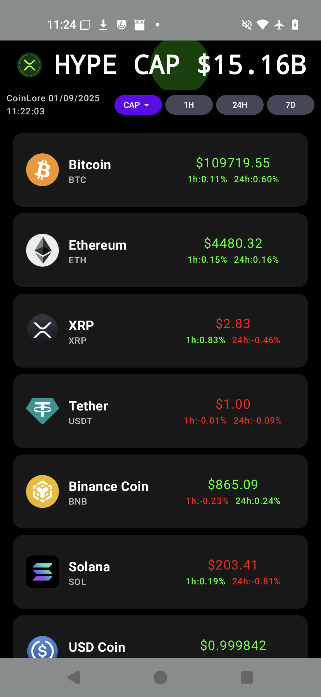

# Simple Crypto Watch

**No‑frills crypto price viewer — works when others bail.**

A tiny, reliable app to peek at crypto prices without the drama. No flashy charts, no endless ads, just the price info you care about — all the time.

  

## What it is

A simple app to view how your favorite cryptocurrencies are doing. No fuss, no fluff — it just shows prices grouped by market cap and gives quick trends for the last hour, 24 hours, or 7 days.

## Not for you if

- You need price updates every single second. This app isn’t built for high-frequency trading or per-second ticks — there are other tools for that.

## Perfect for

- People who roll out of bed, grab their phone, and want a quick heads‑up about their crypto holdings.
- Folks who like prices sorted by market cap and simple trend views (last hour / 24h / 7d).

## Why this exists

Other free apps can be great, but sometimes they hit API limits or throttle the heck outta you and refuse to show prices. I built this because I wanted something that *always* shows a price — even if it’s a minute or two behind — so you’re never left high and dry.

## Features

- Price list grouped by market capitalization.
- Quick trend indicators for: last 1 hour, last 24 hours, last 7 days.
- Lightweight, fast, and easy to use.
- Extremely low chance of being rate‑limited — displays prices reliably with at most a few minutes of latency.

---

**TL;DR:** A simple, dependable crypto price viewer. Not for second‑by‑second traders. Perfect for anyone who wants a quick morning check without the drama.

---

## Download

You can download the APK from the repository Releases or get it on Google Play: https://play.google.com/store/apps/details?id=com.bbnss.purecrypto2

---

*Made with care — keeps showing prices when other apps ghost you.*

